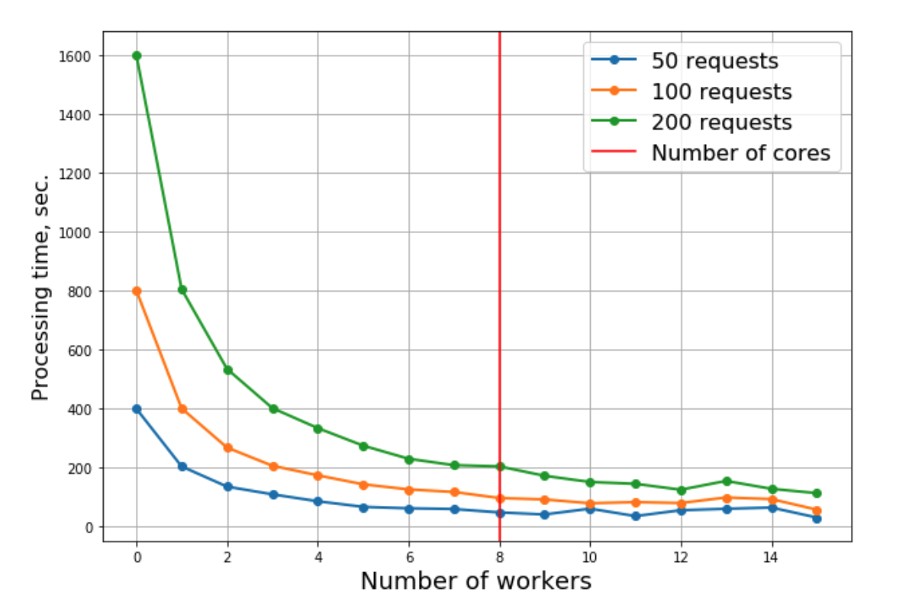
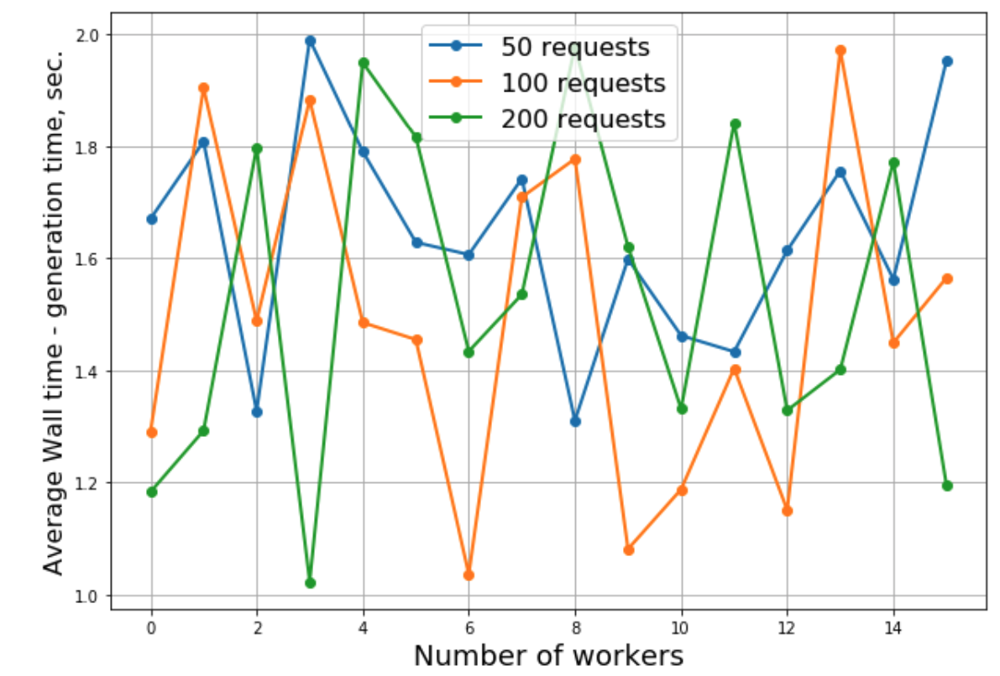

# GPT2-based Dating App bio generation

**Authors**: Maksim Eremeev (eremeev@nyu.edu), Anya Trivedi (anya.trivedi@nyu.edu), Anastasia Shaura (as15846@nyu.edu)

Project Proposal: https://drive.google.com/file/d/1Cj-Gn0p4NIREuzCJ2YG5nmodHVr2dDmC/view?usp=sharing

Project Report: https://drive.google.com/file/d/1EoG3EQLmKB9aXoaBZ_t9TUVfMWsr8vVE/view?usp=sharing

Presentation recording: https://drive.google.com/file/d/1yluJDCI8L45zqTKUxVTLz1vbdOGvCFxo/view?usp=sharing

Presentation slides: https://drive.google.com/file/d/1XA4Gi4-4plwS-6PKdVRsxaDNMZSPucz3/view?usp=sharing

Trained model: https://drive.google.com/file/d/1FP9qzlZBJDmXEhgZX1Pps3Hu3JiTP-2u/view?usp=sharing

Dataset: https://www.kaggle.com/andrewmvd/okcupid-profiles

## Description

This is a scalable deployable system that generates a dating app bio from user features. We used a micro-services architecture to ensure the flexibility and scalability of the system. RabbitMQ is used as a mediator along with the Node.JS-powered backend, allowing us to stick to the Publish-Fetch-Listen communication interface. Training was performed on T4 and RTX8000 GPUs, using the transformers framework. We use distillied GPT-2 model to speed up CPU-only inference in production. We utilize ancestral sampling instead of beam search for diversity. Finally, we test the model offline and online, as well as conducting bandwidth tests of the proposed architecture. All separate components are wrapped into Docker containers, and therefore the system deployment becomes straighforward. 

### Quick start

Make sure ports **22111**,**5672**, and **80** are not busy. 

```bash
git clone https://github.com/maks5507/idls.git

sudo snap install docker

cd idls/

cd services/
docker pull rabbitmq:3.7.14-management
docker-compose up -d

cd ../backend/
docker-compose build
docker-compose up -d

cd ../frontend
docker-compose build
docker-compose up -d

cd ../
docker-compose build
docker-compose up -d
```

The frontend is then available at http://localhost:80

## Code structure

`/frontend` features the jQuery ajax-powered web interface for the product

`/backend` features the Node.JS async-based backend that efficiently packs the requests from frontend and passes them to the message queue. Backend also takes care of CORS blocking the frontend requests

`/services` docker-compose for launching the message queue

`/launcher` is a framework for efficient scale of the workers in the system

`/modeling` comprises of the scripts for training the model

`/core` contains the worker class and configuration

Make sure to check out the READMEs of each component carefully before modifying the system

## Results achieved

Offline evaluation: ROUGE-L-F1 score on test set: **0.37**

Online evaluation: Average user rating of generated sequences: **3.3 out of 5**

Bandwidth tests:

|                                             |                                       |
| ------------------------------------------- | ------------------------------------- |
|  |  |

## Codestyle check

Before making a pull-request, please check the coding style with bash script in `codestyle` directory. Make sure that your folder is included in `codestyle/pycodestyle_files.txt` list.

Your changes will not be approved if the script indicates any incongruities (this does not apply to 3rd-party code). 

Usage:

```bash
cd codestyle
sh check_code_style.sh
```
